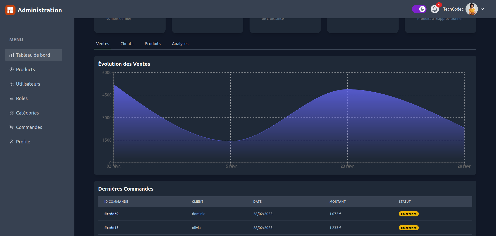

# Admin - E-commerce Application `shop-store`

This folder contains the admin panel code for the `shop-store` e-commerce application. The admin interface is built with React.js and uses Redux for state management.

## Prerequisites

Make sure you have the following installed on your machine:
- Node.js (version 18 or higher)
- npm (version 9 or higher)

## Installation

1. Install the dependencies:

```bash
cd admin
npm install --legacy-peer-deps
```

2. Create a `.env` file at the root of the admin folder and add the following environment variables:

```env
VITE_API_URL=http://localhost:3000/api
VITE_API_SOCKET_URL=http://localhost:3000
```

## Running the Development Server

To start the development server:

```bash
npm run dev
```

The application will be accessible at `http://localhost:your_port`.

## Project Structure

- `components` : Contains reusable React components.
- `pages` : Contains the different pages of the application.
- `reducers` : Contains Redux reducer files.
- `actions` : Contains Redux action files.
- `store` : Contains the Redux store configuration files.
- `utils` : Contains utility functions.
- `context` : Contains the various application contexts.

## Demo

- **Online Demo**: [Link to live site](https://admin-shop-store.vercel.app/)
    - Example account (email: useralain99@gmail.com, password: 1234567)
    - Or you can simply create your own account by signing up with a valid email.
- **Video Demo on YouTube**: [Link to the video](https://www.youtube.com/watch?v=-skrT-X8nPs)

## Overview

### Dashboard on Desktop


### Dashboard on Mobile


### Client Activity Analysis


### Sales Analysis



### Traffic Analysis


### Product Analysis


### Editing a Product on Desktop


### Editing a Product on Mobile


### Editing a User on Desktop


### Editing a User on Mobile


### Editing a Category on Desktop


### Editing a Category on Mobile


### User Account Settings on Desktop


### User Account Settings on Mobile


### Order Display on Desktop


### Order Display on Mobile


### Order Details Display

