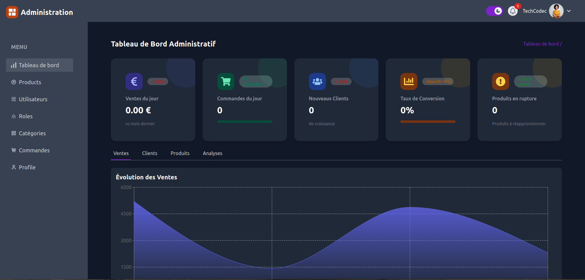

# Admin - E-commerce Application `shop-store`

Ce dossier contient le code du panneau d'administration de l'application e-commerce `shop-store`. L'interface admin est construite avec React.js et utilise Redux pour la gestion de l'état.

## Prérequis

Assurez-vous d'avoir les éléments suivants installés sur votre machine :
- Node.js (version 18 ou supérieure)
- npm (version 9 ou supérieure)

## Installation

1. Installez les dépendances :

```bash
cd admin
npm install --legacy-peer-deps
```

2. Créez un fichier `.env` à la racine du dossier admin et ajoutez les variables d'environnement suivantes :

```env
VITE_API_URL = http://localhost:3000/api
VITE_API_SOCKET_URL = http://localhost:3000
```

## Démarrage

Pour démarrer le serveur de développement :

```bash
npm run dev
```

L'application sera accessible sur `http://localhost:your_port`.

## Structure du projet

- `components` : Contient les composants React réutilisables.
- `pages` : Contient les différentes pages de l'application.
- `reducers` : Contient les fichiers relatifs à Redux qui sont des reducers.
- `actions` : Contient les fichiers relatifs à Redux qui sont des actions.
- `store` : Contient les fichiers relatifs à Redux qui est le store.
- `utils` : Contient les fonctions utilitaires.
- `context` : contient les différents context de l'application

## Démo

- **Démo en ligne** : [lien du site en ligne](https://admin-shop-store.vercel.app/)
    - exemple de compte (email:useralain99@gmail.com , password: 1234567)
    - ou vous pouvez créer simplement votre compte en vous s'inscrivant avec un mail valide
- **Démo de la video en ligne sur ma chaine youtube**: [lien de la vidéo en ligne](https://www.youtube.com/watch?v=-skrT-X8nPs)


## aperçu

### dashboad sur ordinateur



### dashboad sur téléphone


### analyse activités clients


### analyse des ventes


### analyse du trafic


### analyse product


### l'édition d'un produit sur ordinateur


### l'édition d'un produit sur téléphone


### l'édition d'un utilisateur sur ordinateur


### l'édition d'un utilisateur sur ordinateur


### l'édition d'une catégorie sur ordinateur


### l'édition d'une catégorie sur téléphone


### paramètre compte user sur ordinateur


### paramètre compte user sur téléphone


### affichage commade sur ordinateur


### affichage commade sur téléphone


### affichage des détailles d'une commade 

