# Frontend - E-commerce Application `shop-store`

Ce dossier contient le code client de l'application e-commerce `shop-store`. Le frontend est construit avec React.js et utilise Redux pour la gestion de l'état.

## Prérequis

Assurez-vous d'avoir les éléments suivants installés sur votre machine :
- Node.js (version 18 ou supérieure)
- npm (version 9 ou supérieure)

## Installation

1. Installez les dépendances :

```bash
cd frontend
npm install --legacy-peer-deps
```

2. Créez un fichier `.env` à la racine du dossier frontend et ajoutez les variables d'environnement suivantes :

```env
VITE_API_URL =http://localhost:3000/api
```

## Démarrage

Pour démarrer le serveur de développement :

```bash
npm run dev
```

L'application sera accessible sur `http://localhost:your_port`.

## Structure du projet

- `components` : Contient les composants React réutilisables.
- `pages` : Contient les différentes pages de l'application.
- `reducers` : Contient les fichiers relatifs à Redux qui sont des reducers.
- `actions` : Contient les fichiers relatifs à Redux qui sont des actions.
- `store` : Contient les fichiers relatifs à Redux qui est le store.
- `utils` : Contient les fonctions utilitaires.
- `context` : contient les différents context de l'application

## Démo

- **Démo en ligne** : [lien du site en ligne](https://shop-store-one.vercel.app/)
- **Démo de la video en ligne sur ma chaine youtube**: [lien de la vidéo en ligne]()

## aperçu

### page d'accueil sur ordinateur

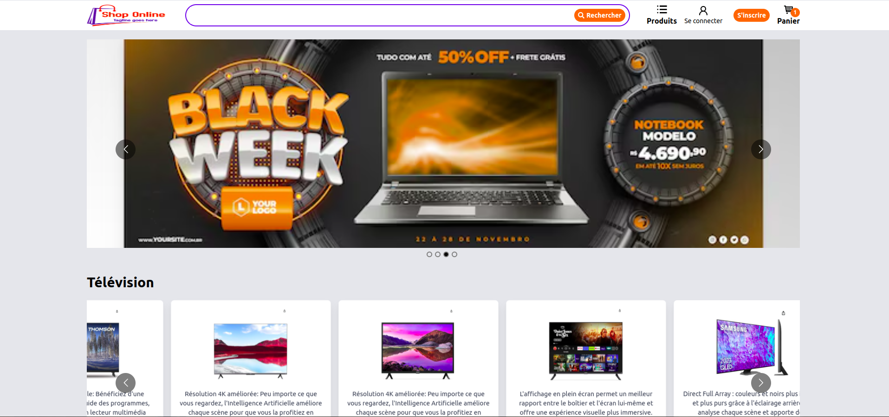

### page d'accueil sur téléphone

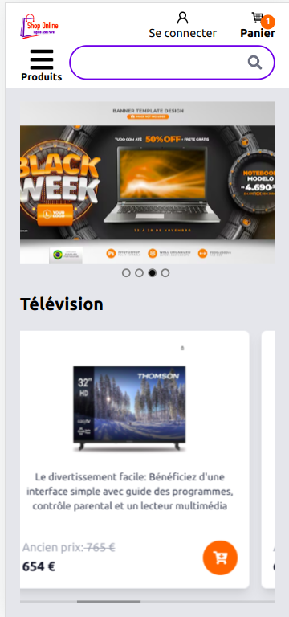

### exmple page catégorie sur ordinateur

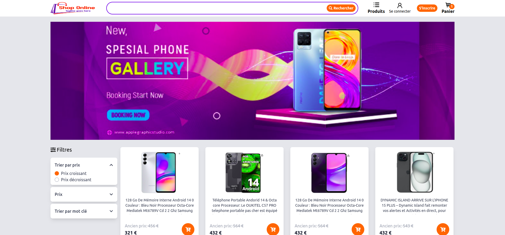

### exmple page catégorie sur téléphone

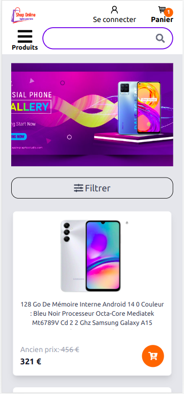


### filter sur téléphone

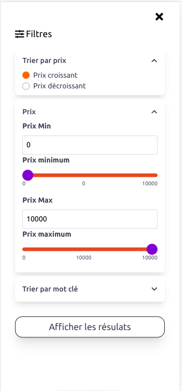

### page présentation d'un produit sur ordinateur


### page présentation d'un produit sur téléphone


### page de connexion sur ordinateur

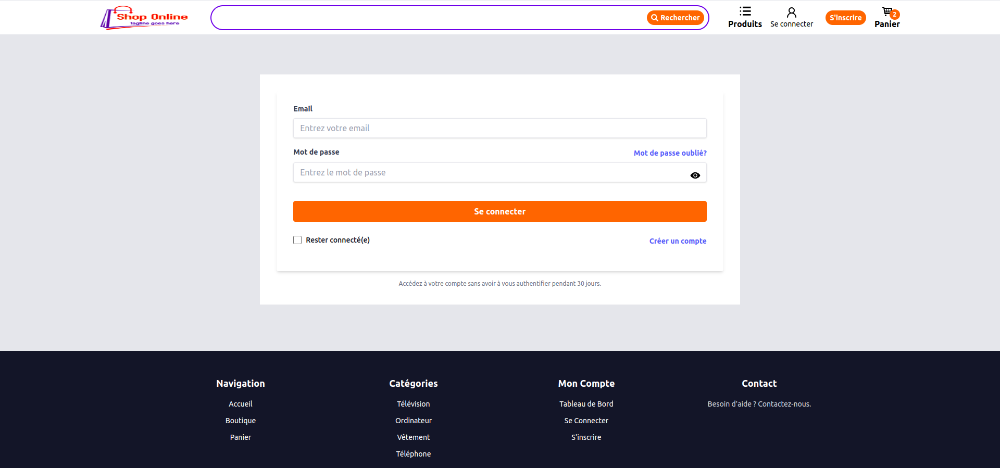

### page de connexion sur téléphone

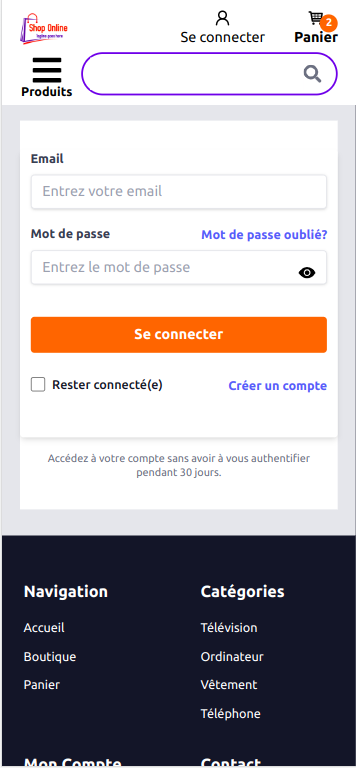


### présentation de la recherche sur ordinateur

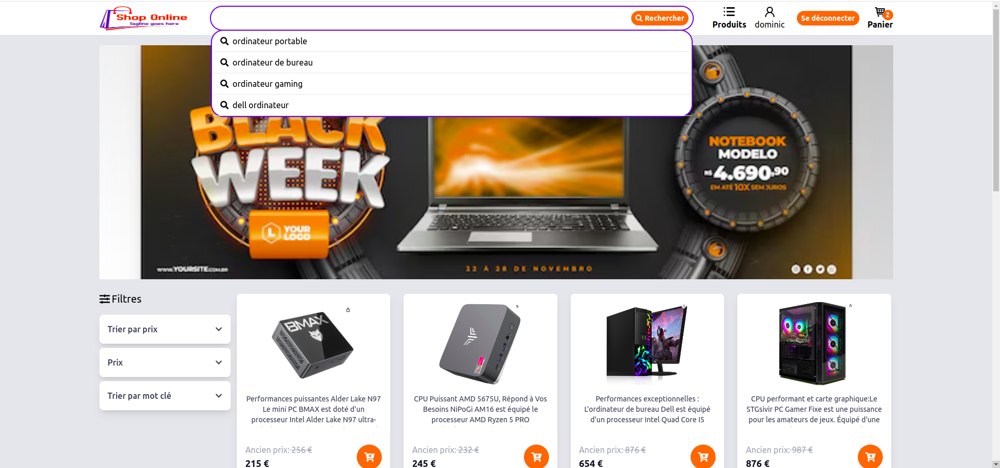

### présentation de la recherche sur téléphone

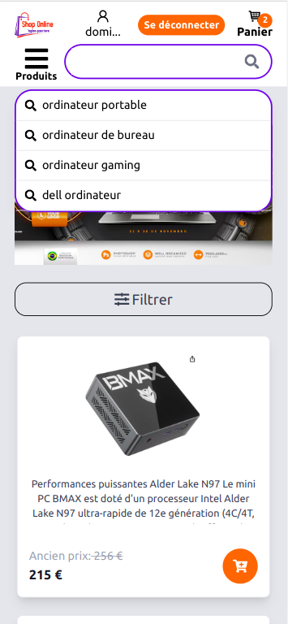

### page de payement sur ordinateur

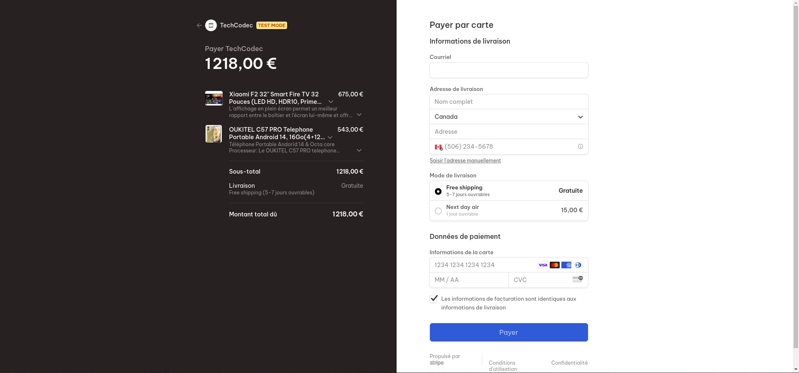


### page de payement sur téléphone

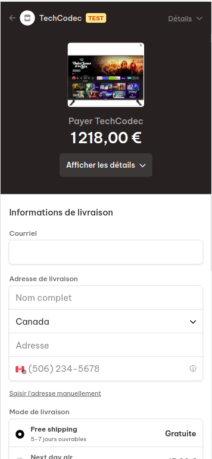